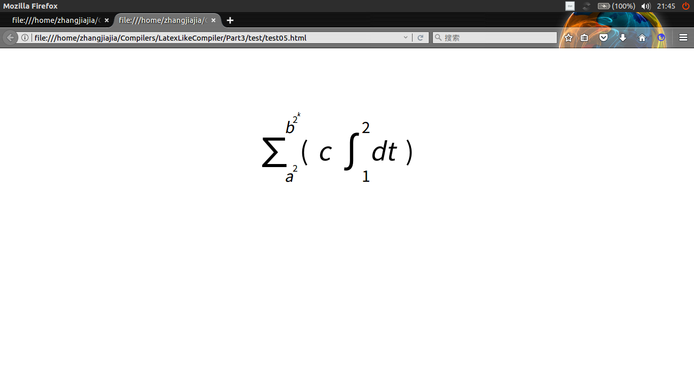

#<center>编译原理实验报告</center>
<center>张佳佳</center>
<center>PB14210032</center>

###一、文法
`S->$B$`  
`B->BB`  
`B->B_^{B}{B}`  
`B->B^{B}`  
`B->B_{B}`  
`B->\int{B}{B}{B}`  
`B->\sum{B}{B}{B}`  
`B->id | num | \blank | (B)`

###二、词法分析器
依据文法可提取词法单元和对应词素如下
<table>
    <tr>
        <th>词法单元</th>
        <th>词素</th>
    </tr>
    <tr>
        <td>DOLLAR</td>
        <td>$</td>
    </tr>
    <tr>
        <td>SUB</td>
        <td>_</td>
    </tr>
    <tr>
        <td>SUP</td>
        <td>^</td>
    </tr>
    <tr>
        <td>LEFTBRACE</td>
        <td>{</td>
    </tr>
    <tr>
        <td>RIGHTBRACE</td>
        <td>}</td>
    </tr>
    <tr>
        <td>LEFTBRACKET</td>
        <td>(</td>
    </tr>
    <tr>
        <td>RIGHTBRACKET</td>
        <td>)</td>
    </tr>    
    <tr>
        <td>INT</td>
        <td>\int</td>
    </tr>
    <tr>
        <td>SUM</td>
        <td>\sum</td>
    </tr>
    <tr>
        <td>ID</td>
        <td>[a-zA-Z][a-zA-Z0-9]*</td>
    </tr>
    <tr>
        <td>NUM</td>
        <td>[0-9]+</td>
    </tr>
    <tr>
        <td>BLANK</td>
        <td>\blank</td>
    </tr>
</table>

####有限状态机
显然，对词素`$`,`_`,`^`,`{`,`}`,`(`,`)`的识别较为简单，有限状态机如下 
 
  

<br>

而对ID和NUM的识别需要向后多看一个字符，故有限状态机如下  

  

<br>

对以\开头的词素`\int`,`\sum`,`\blank`识别的有限状态机如下  

  

综合以上三者，总的识别机制的有限状态机不难得到，只需将0状态合并即可，以为状态繁多较难绘制，况且，上述三个状态机已经足够言明此问题，故不再绘制。  
 
####词法分析
词素提取完毕且有限状态机绘制完毕后即可着手编写词法分析程序`LexicalAnalysis`，词法分析器程序的主体部分为`GetNextToken`,为主要的词法分析部分，其中词法分析程序还包含了一个定义了token的头文件`tokendef.h`,其内容如下：
```C
enum{
	SUB,
	SUP,
	LEFTBRACE,
	RIGHTBRACE,
	LEFTBRACKET,
	RIGHTBRACKET,
	INT,
	SUM,
	ID,
	NUM,
	BLANK,
	DOLLAR
};
char *TokenStr[] = {
	"SUB",
	"SUP",
	"LEFTBRACE",
	"RIGHTBRACE",
	"LEFTBRACKET",
	"RIGHTBRACKET",
	"INT",
	"SUM",
	"ID",
	"NUM",
	"BLANK",
	"DOLLAR"
};
```
作用为定义各个token对应的int值和string值，方便后期操作。
主要函数`GetNextToken`的作用是传入一个文件指针，从指针处往后读字符，检测到token或者出现错误时返回，主要内容如下
```C
int GetNextToken( FILE *stream )
{
	char ch;
	ch = fgetc(stream);
	if ( ch == EOF)
	    return -1;
	switch (ch){
		/*ignore blanks*/
		case ' ':
		case '\n':
		case '\t':
		case '\r':
			return GetNextToken(stream);
			break;
		case '$':
			return DOLLAR;
			break;
		case '_':
			return SUB;
			break;
		case '^':
			return SUP;
			break;
		case '{':
			return LEFTBRACE;
			break;
		case '}':
			return RIGHTBRACE;
			break;
		case '(':
			return LEFTBRACKET;
			break;
		case ')':
			return RIGHTBRACKET;
			break;

		case '\\':
			/*Test \int \sum or \blank*/
            .......
            .......

		default:
			/*Test NUM or ID*/
			......
			......
		}
```
至此词法分析器已经完成  
鉴于此题无法使用符号表，程序中定义了全局变量num和id以存储识别出的NUM或ID的值
###三、语法分析器
由于使用LR语法分析会导致项集非常庞大，代码复杂度会大大升高，为此考虑使用LL(1)文法分析，但显然此文法是左递归的，不可能是LL(1)文法，但是可以略微更改文法以使此文法变成贴近LL(1)的，方法如下：  
  
  

此时文法很接近与LL(1)的，但是由于文法本身是二义的，故还不是LL(1)的，但是依旧可以使用LL(1)文法的分析方法，只需在具体实施做一点变通。  
依据修改后的文法，`First`和`Follow`集如下：  
  
  
  
由此可构造预测分析表如下：  

  
  
其中的青色部分表明有冲突出现，鉴于文法是二义的，这种情形是必然的。  
对此种情形的处理是依据语法分析时的语法符号栈来具体判定使用哪一个产生式，为此考察如下两种情况，每当遇到一个会出现冲突的token，且栈顶为B'时，若token为`(` `)` `INT` `SUM` `ID` `NUM` `BLANK`  时

  
  
显然，依据预测分析表可知，两者的冲突之处在与选择产生式`B'->nil`和`B'->BB'`,显然对于情形一来说，使用产生式`B->nil`是合适的，因为B'下面已经有了一个B，可以接收可能出现冲突的输入的符号，而对于情形二来说，使用产生式`B->BB'`是合适的，因为若是使用`B->nil`则输入的符号无法接收，会出现错误，而实际上不应该出现错误，因为是使用正确的语法推导出来的  
若token为`_` 时, 同样有两种情况：  

  
  
处理方案如上，至此，语法的二义性问题已经解决，可以使用LL(1)的方法进行语法分析。  
进行语法分析之前，需要将词法分析程序转换成头文件且对`tokendef.h`进行更改，添加非终结符号：  
```C
#ifndef TOKENDEF_H
#define TOKENDEF_H

enum{
    //终结符号 0-11
    DOLLAR,
	SUB,
	SUP,
	LEFTBRACE,
	RIGHTBRACE,
	LEFTBRACKET,
	RIGHTBRACKET,
	INT,
	SUM,
	ID,
	NUM,
	BLANK,
	
	//非终结符号 12-15
	S,
	B,
	B1,
	C
};
char *TokenStr[] = {
    "DOLLAR",
	"SUB",
	"SUP",
	"LEFTBRACE",
	"RIGHTBRACE",
	"LEFTBRACKET",
	"RIGHTBRACKET",
	"INT",
	"SUM",
	"ID",
	"NUM",
	"BLANK",
	"S",
	"B",
	"B'",
	"C"
};
char *TokenChar[] = {
    "$",
    "-",
    "^",
    "{",
    "}",
    "(",
    ")",
    "INT",
    "SUM",
    "ID",
    "NUM",
    "BLANK",
    "S",
    "B",
    "B'",
    "C"
};
#endif
```
同时编写`languagedef.h`添加语法规则信息：  
```C
#ifndef LANGUAGEDEF_H
#define LANGUAGEDEF_H

#define PRODUCTION_BASE 16
enum{
    //产生式 16-28
    Production1 = PRODUCTION_BASE,
    Production2,
    Production3,
    Production4,
    Production5,
    Production6,
    Production7,
    Production8,
    Production9,
    Production10,
    Production11,
    Production12,
    Production13
};

char *ProductionString[] = {
    "S-> $B$",              //1
    "B-> INT {B}{B}{B}B'",  //2 
    "B-> SUM {B}{B}{B}B'",  //3
    "B-> ID B'",            //4
    "B-> NUM B'",           //5
    "B-> BLANK B'",         //6
    "B-> (B)B'",            //7
    "B'-> BB'",             //8
    "B'-> _C",              //9
    "B'-> ^{B}B'",          //10
    "B'-> nil",             //11
    "C-> ^{B}{B}",          //12
    "C-> {B}"               //13
};

#endif
```
为避免产生式和token混淆，产生式代表的int值从16开始  
至此，准备工作已经做完，SyntaxAnalysis源程序框架如下：  
其中MatchedToken函数用以判断栈顶和token是否匹配  
ParsingError函数为错误处理函数，会打印出错时语法栈信息  
```C
int Parser(FILE *stream, Stack *SyntaxStack)
{
			
	static int matched = 1;  //用以判断是否匹配到非终结符
	static int token;
	static int start = 0;  //用以判断是否开始的$还是终止的$符号
	if (start == 0 && IsEmpty(SyntaxStack))
	{
		Push(SyntaxStack, S);
		start = 1;
	}	
	if (start != 0 && IsEmpty(SyntaxStack))
	{
	    return -1;
	}

	if (matched == 1)  //若匹配到token，则调用词法分析，再次读入一个token
	{
		token = GetNextToken(stream);
		matched = 0;
	}
	
	//直接和栈顶匹配
	if (MatchedToken(SyntaxStack, token))  //若栈顶直接和token匹配，则返回token，且token出栈
	
	{
		matched =1;
		Pop(SyntaxStack);
		return token;
	}

	//不直接和栈顶匹配
	switch (token){
		case DOLLAR:
			if (MatchedToken(SyntaxStack, S))  //依据S-> $B$入栈
			{
				Pop(SyntaxStack);
				Push(SyntaxStack, DOLLAR);
				Push(SyntaxStack, B);
				Push(SyntaxStack, DOLLAR);

				return Production1;
			}
			if (MatchedToken(SyntaxStack, B1))  //使用B'-> nil
			{
				Pop(SyntaxStack);
				return Production11;
			}
			else
				ParsingError(token, SyntaxStack);
			break;
		case SUB:
		    //冲突情形，栈顶为_的情况已经被栈顶直接匹配处理
			if (MatchedToken(SyntaxStack, B1))  //依据B'-> _C入栈
			{
				Pop(SyntaxStack);
				Push(SyntaxStack, C);
				Push(SyntaxStack, SUB);
				return Production9;
			}
			else
				ParsingError(token, SyntaxStack);
			break;
		case SUP:
			if (MatchedToken(SyntaxStack, B1))  //依据B'-> ^{B}B'入栈
			{
				Pop(SyntaxStack);
				Push(SyntaxStack, B1);
				Push(SyntaxStack, RIGHTBRACE);
				Push(SyntaxStack, B);
				Push(SyntaxStack, LEFTBRACE);
				Push(SyntaxStack, SUP);
				return Production10;
			}
			else if (MatchedToken(SyntaxStack, C))  //依据C-> ^{B}{B}入栈
			{
				Pop(SyntaxStack);
				Push(SyntaxStack, RIGHTBRACE);
				Push(SyntaxStack, B);
				Push(SyntaxStack, LEFTBRACE);
				Push(SyntaxStack, RIGHTBRACE);
				Push(SyntaxStack, B);
				Push(SyntaxStack, LEFTBRACE);
				Push(SyntaxStack, SUP);
				return Production12;
			}
			else
				ParsingError(token, SyntaxStack);
			break;
		case LEFTBRACE:
			if (MatchedToken(SyntaxStack, C))
			{
				Pop(SyntaxStack);
				Push(SyntaxStack, RIGHTBRACE);
				Push(SyntaxStack, B);
				Push(SyntaxStack, LEFTBRACE);
				return Production13;
			}
			else
				ParsingError(token, SyntaxStack);
			break;
		case RIGHTBRACE:
			if (MatchedToken(SyntaxStack, B1))
			{
				Pop(SyntaxStack);
				return Production11;
			}
			else
				ParsingError(token, SyntaxStack);
			break;
		case LEFTBRACKET:
			if (MatchedToken(SyntaxStack, B))
			{
				Pop(SyntaxStack);
				Push(SyntaxStack, B1);
				Push(SyntaxStack, RIGHTBRACKET);
				Push(SyntaxStack, B);
				Push(SyntaxStack, LEFTBRACKET);
				return Production7;
			}
			else if (MatchedToken(SyntaxStack, B1))
			{
				Pop(SyntaxStack);
				Push(SyntaxStack, B1);
				Push(SyntaxStack, B);
				return Production8;
			}
			else
				ParsingError(token, SyntaxStack);
			break;
		case RIGHTBRACKET:
			if (MatchedToken(SyntaxStack, B1))
			{
				Pop(SyntaxStack);
				return Production11;
			}
			else
				ParsingError(token, SyntaxStack);
			break;
		case INT:
			if (MatchedToken(SyntaxStack, B))
			{
				Pop(SyntaxStack);
				Push(SyntaxStack, B1);
				Push(SyntaxStack, RIGHTBRACE);
				Push(SyntaxStack, B);
				Push(SyntaxStack, LEFTBRACE);
				Push(SyntaxStack, RIGHTBRACE);
				Push(SyntaxStack, B);
				Push(SyntaxStack, LEFTBRACE);
				Push(SyntaxStack, RIGHTBRACE);
				Push(SyntaxStack, B);
				Push(SyntaxStack, LEFTBRACE);
				Push(SyntaxStack, INT);
				return Production2;
			}
			else if (MatchedToken(SyntaxStack, B1))  //出现冲突情形
			{
				Pop(SyntaxStack);
				if (!IsEmpty(SyntaxStack) && MatchedToken(SyntaxStack, B))  //B'下为B，使用B'-> nil
					return Production11;
				else    //否则使用B'-> BB'
				{
					Push(SyntaxStack, B1);
					Push(SyntaxStack, B);
					return Production8;
				}
			}
			else
				ParsingError(token, SyntaxStack);

			break;
		case SUM:
			if (MatchedToken(SyntaxStack, B))
			{
				Pop(SyntaxStack);
				Push(SyntaxStack, B1);
				Push(SyntaxStack, RIGHTBRACE);
				Push(SyntaxStack, B);
				Push(SyntaxStack, LEFTBRACE);
				Push(SyntaxStack, RIGHTBRACE);
				Push(SyntaxStack, B);
				Push(SyntaxStack, LEFTBRACE);
				Push(SyntaxStack, RIGHTBRACE);
				Push(SyntaxStack, B);
				Push(SyntaxStack, LEFTBRACE);
				Push(SyntaxStack, SUM);
				return Production3;
			}
			else if (MatchedToken(SyntaxStack, B1))  //出现冲突情形
			{
				Pop(SyntaxStack);
				if (!IsEmpty(SyntaxStack) && MatchedToken(SyntaxStack, B))
					return Production11;
				else
				{
					Push(SyntaxStack, B1);
					Push(SyntaxStack, B);
					return Production8;
				}
			}
			else
				ParsingError(token, SyntaxStack);
			break;
		case ID:
			if (MatchedToken(SyntaxStack, B))
			{
				Pop(SyntaxStack);
				Push(SyntaxStack, B1);
				Push(SyntaxStack, ID);
				return Production4;
			}
			else if (MatchedToken(SyntaxStack, B1))  //出现冲突情形
			{
				Pop(SyntaxStack);
				if (!IsEmpty(SyntaxStack) && MatchedToken(SyntaxStack, B))
					return Production11;
				else
				{
					Push(SyntaxStack, B1);
					Push(SyntaxStack, B);
					return Production8;
				}
			}
			else
				ParsingError(token, SyntaxStack);
			break;
		case NUM:
			if (MatchedToken(SyntaxStack, B))
			{
				Pop(SyntaxStack);
				Push(SyntaxStack, B1);
				Push(SyntaxStack, NUM);
				return Production5;
			}
			else if (MatchedToken(SyntaxStack, B1))  //出现冲突情形
			{
				Pop(SyntaxStack);
				if (!IsEmpty(SyntaxStack) && MatchedToken(SyntaxStack, B))
					return Production11;
				else
				{
					Push(SyntaxStack, B1);
					Push(SyntaxStack, B);
					return Production8;
				}
			}
			else
				ParsingError(token, SyntaxStack);
			break;
		case BLANK:
			if (MatchedToken(SyntaxStack, B))
			{
				Pop(SyntaxStack);
				Push(SyntaxStack, B1);
				Push(SyntaxStack, BLANK);
				return Production6;
			}
			else if (MatchedToken(SyntaxStack, B1))  //出现冲突情形
			{
				Pop(SyntaxStack);
				if (!IsEmpty(SyntaxStack) && MatchedToken(SyntaxStack, B))
					return Production11;
				else
				{
					Push(SyntaxStack, B1);
					Push(SyntaxStack, B);
					return Production8;
				}
			}
			else
				ParsingError(token, SyntaxStack);
			break;
	}

}
```  
上述入栈情形只注释了部分，可以直接依据返回的产生式看出。  
至此，语法分析已经完成
###三、语法制导翻译
首先定义属性有top、left和fontsize均为继承属性  
为避免建立语法分析树，翻译主要使用递归，对需要写入的非终结符(`ID` `NUM`等)直接写入html代码，对产生式递归调用自身，直到遇到非终结符。  
翻译的具体实现主要依赖与函数writeHtmlBody，函数原型如下：  
```C
int writeHtmlBody(FILE *instream, FILE *outstream, Stack *SyntaxStack, int top, int left, int fontsize)
```
SyntaxStack为语法栈， top、left、fontsize为相应属性，对需要写入html的非终结符，函数的作用如下，以ID(ph)为例:  

  
  
依据top、left、fontsize输入参数写html，并返回ID的宽度，具体代码如下：  
```C
case LEFTBRACKET:
	fprintf(outstream, "<div style=\"position: absolute; top:%dpx; left:%dpx;\"><span style=\"font-size:%dpx; font-style:normal;line-height:100%;\">(</span></div>\n", top, left, fontsize);
	width = (int)(fontsize*0.7);
	return width;
case RIGHTBRACKET:
	fprintf(outstream, "<div style=\"position: absolute; top:%dpx; left:%dpx;\"><span style=\"font-size:%dpx; font-style:normal;line-height:100%;\">)</span></div>\n", top, left, fontsize);
	width = (int)(fontsize*0.7);
	return width;
case INT:
	fprintf(outstream, "<div style=\"position: absolute; top:%dpx; left:%dpx;\"><span style=\"font-size:%dpx; font-style:normal;line-height:100%;\">&int;</span></div>\n", top - (int)(0.3*fontsize), left, (int)(fontsize*1.6));
	width = (int)(fontsize*1.2);
	return width;
case SUM:
	printf(outstream, "<div style=\"position: absolute; top:%dpx; left:%dpx;\"><span style=\"font-size:%dpx; font-style:normal;line-height:100%;\">&sum;</span></div>\n", top - (int)(0.3*fontsize), left, (int)(fontsize*1.6));
	width = (int)(fontsize*1.2);
	return width;
case ID:
	fprintf(outstream, "<div style=\"position: absolute; top:%dpx; left:%dpx;\"><span style=\"font-size:%dpx; font-style:oblique;line-height:100%;\">%s</span></div>\n", top, left, fontsize, id);
	width = (int)(fontsize*strlen(id)*0.55);
	return width;
case NUM:
	printf(outstream, "<div style=\"position: absolute; top:%dpx; left:%dpx;\"><span style=\"font-size:%dpx; font-style:normal;line-height:100%;\">%s</span></div>\n", top, left, fontsize, num);
	width = (int)(fontsize*strlen(num)*0.55);
	return width;
case BLANK:
	fprintf(outstream, "<div style=\"position: absolute; top:%dpx; left:%dpx;\"><span style=\"font-size:%dpx; font-style:normal;line-height:100%;\">%s</span></div>\n", top, left, fontsize, " ");
	width = fontsize*0.7;
	return width;
```
显然上面的代码对INT和SUM的处理与通常的ID和NUM等的处理有所区别，原因是∑和∫的字符应该比正常的字符显示较大，故做了调整 top = top - (int)(0.3*fontsize)， 及fontsize = (int)(fontsize*1.6))以便显示起来更为美观，另外各个非终结符返回的宽度与fontsize相关，但最终参数为根据具体显示效果调整，此外ID的html写入改变了font-style属性为oblique。  
函数writeHtmlBody对产生式的处理更为复杂一点，它通过递归来实现对整个产生式的处理，以`B-> INT {B}{B}{B}B'`为例，代码如下：  
```C
int type;
int width = 0;
int sub_fontsize, sub_top, sub_left, sub_width;
int sup_fontsize, sup_top, sup_left, sup_width;

type = Parser(instream, SyntaxStack);  //调用语法分析程序返回token或者产生式

switch (type）{
...

case Production2:	//B-> INT {B1}{B2}{B3}B'			
	width += writeHtmlBody(instream, outstream, SyntaxStack, top, left, fontsize);				
	//{
	Parser(instream, SyntaxStack);  //跳过不使用的符号
	//B1, 下标
	sub_fontsize = (int)(fontsize*0.6);
	sub_top = top + (int)(fontsize*1.2) ;
	sub_left = left + width;
	sub_width = writeHtmlBody(instream, outstream, SyntaxStack, sub_top, sub_left, sub_fontsize);
	//}
	Parser(instream, SyntaxStack);  //跳过不使用的符号				
	//{
	Parser(instream, SyntaxStack);  //跳过不使用的符号
	//B2， 上标
	sup_fontsize = (int)(fontsize*0.6);
	sup_top = top - (int)(sup_fontsize*1.2);
	sup_left = left + width;
	sup_width = writeHtmlBody(instream, outstream, SyntaxStack, sup_top, sup_left, sup_fontsize);
	//}
	Parser(instream, SyntaxStack);    //跳过不使用的符号		
	if (sub_width >= sup_width)  //占用宽度为上下标中宽度占用较大的那个
		width += sub_width;
	else
		width += sup_width;				
	//{
	Parser(instream, SyntaxStack);  //跳过不使用的符号
	//B3, 中间
	width += writeHtmlBody(instream, outstream, SyntaxStack, top, left + width, fontsize);
	//}
	Parser(instream, SyntaxStack);  //跳过不使用的符号
	//B'
	width += writeHtmlBody(instream, outstream, SyntaxStack, top, left + width, fontsize);
	return width;
...
}
```
具体思路为，设置变量width，初始化为0,方便每次写入html时的left属性的变化(写入过东西后left要增加)，以及最终返回递归写入产生式所占用的宽度，对于其他的产生式实现方法类似，具体见实际代码。  
对于出错的输入，函数采取将遇到错误前的所有正确内容写入html，一旦遇到出错信息直接写入html结尾的方式，输出输入错误前的正确输入所对应html代码。    
至此，语法指导翻译主体部分已经完成，只需要执行包裹函数(如下)，即可完成翻译  
```C
void Translator(FILE *instream, FILE *outstream)
{
	Stack SyntaxStack;
	InitStack(&SyntaxStack);
	
	int TOP = 175;
	int LEFT = 500;
	int FONTSIZE = 50;
	
	writeHtmlHead(outstream);
	writeHtmlBody(instream, outstream, &SyntaxStack, TOP, LEFT, FONTSIZE);
	writeHtmlTail(outstream);

}
```
###四、样例测试
网上共计10个样例，1-7为正确样例，8-10为错误样例，我本人又添加了一个极为复杂的样例11,以验证程序的正确性。  
####测试环境
`Ubuntu16.04 LTS`  
内核  
Linux lenovo 4.4.0-78-generic #99-Ubuntu SMP Thu Apr 27 15:29:09 UTC 2017 x86_64 x86_64 x86_64 GNU/Linux  
浏览器: Firefox浏览器  
自动测试脚本autotest.sh  
```bash
#!/bin/sh

echo Begin Test...

for file in ./*.txt; do
    echo
	echo "*******test ${file}*******"
	./Translator ${file}
	if [ $? -eq 0 ]
    then
	    echo ...Test Pass...
    fi	
done

echo
echo "*******Test Done!*******"
echo
```
在test文件夹下运行自动测试脚本，输出为：  
```
Begin Test...

*******test ./test01.txt*******
...Test Pass...

*******test ./test02.txt*******
...Test Pass...

*******test ./test03.txt*******
...Test Pass...

*******test ./test04.txt*******
...Test Pass...

*******test ./test05.txt*******
...Test Pass...

*******test ./test06.txt*******
...Test Pass...

*******test ./test07.txt*******
...Test Pass...

*******test ./test08.txt*******
Parsing Error!
  Error when meet token LEFTBRACE
  Stack Status:
栈中元素：top -> bottom
B  $  

*******test ./test09.txt*******
Parsing Error!
  Error when meet token DOLLAR
  Stack Status:
栈中元素：top -> bottom
}  B'  $  

Parsing Error!
  Error when meet token DOLLAR
  Stack Status:
栈中元素：top -> bottom
}  B'  $  

*******test ./test10.txt*******
Lexical error: Unrecognized token

*******test ./test11.txt*******
...Test Pass...

*******Test Done!*******

```
实验所得html代码显示部分结果如下：  
   
   
   
   
   

###五、软件设计
####项目结构
项目名称 `LatexLikeCompiler`
文件结构：  
```
-Part1  
  --code  
    ---LexicalAnalysis.c  
    ---tokendef.h  
  --img(DFA图片和svg矢量图)  
-Part2  
  --code
    ---LexicalAnalysis.h  
    ---tokendef.h  
    ---languagedef.h
    ---stack.h
    ---SyntaxAnalysis.c
  --img(文法转换图预测分析表图和相应svg矢量图)
-Part3  
  --code
    ---LexicalAnalysis.h  
    ---tokendef.h  
    ---languagedef.h
    ---stack.h
    ---SyntaxAnalysis.h
    ---Translation.c
  --img(相关图片资源)
-src(图片资源集合)
-PB14210032.md(实验报告markdown版)
-PB14210032.pdf(实验报告pdf版)
```
###六、心得体会
此次大作业，极大地增强了我对编译原理这门课的认识，在实现层面上对课上的内容进行了深入的理解。同时，此次大作业也极大地提升了我的C语言编程能力和动手实现、问题解决能力，收益良多！
